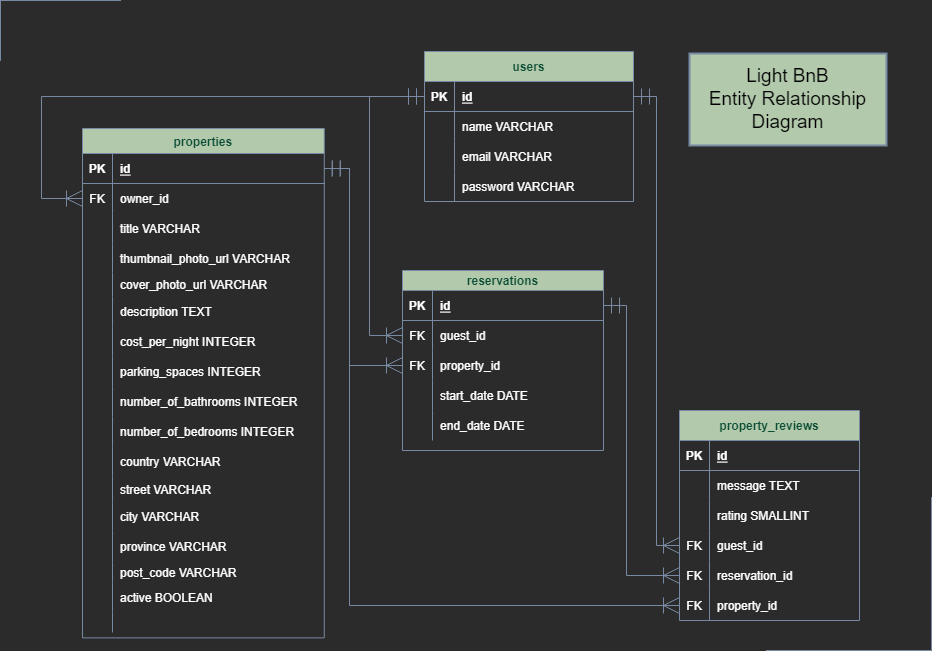

# Light BnB, a full-stack app that communicates with a PostgreSQL server

The LightBnB_WebApp was provided with dummy routes to JSON files which we had to reroute to communicate with a PostgreSQL server which we set up using the ERD below. 

As a result, many front-end features are choppy as I have not had the time to refine them with most of my work being
on the back-end.

Features which I implemented:
* The main page creates property listings from the database rather than a local JSON file
* Users can be created and signed into using the Postgres database.
* New properties can be posted belonging to a registered user in the database.
* Reservations can be created for a specified property for a user in the database.
* Users can view their reservations, search for property listings by city, cost, and rating all from the database.

Features which I want to fix still that I'm aware of:
* When a user makes a reservation they should be routed to their reservations but instead get plain text html.

Features which should be implemented but weren't in the scope of the project while learning:
* Users should be able to post a review of a property they have had a reservation at, but no functionality for this exists despite the database being designed to handle this data

# Entity Relationship Diagram

## Dependencies

This project uses:
* Node-postgres
* Express
* Router
* Sass
* PostgreSQL
* jquery
* cookie-session
* body-parser
* bcrypt